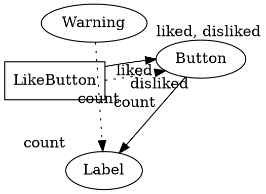

[よくないねボタン - Poem](/poem/items/yokunaine)
よくないよ。こんなこと
大好評をいただいている[よくないねボタン](/poem/items/yokunaine)ですが、おかげさまで512よくないねを達成しました:tada:
それを記念して、大幅にちょっとだけ変更を加えました。バージョン：0.0.4⇒0.1.0
_**変更点をご紹介します！**_

# RFC 7807に対応した
めちゃくちゃどうでもいいことですが、エラー表現を[RFC 7807](https://tools.ietf.org/html/rfc7807)に対応させました。エラーなんて見る人いないと思いますが、ちゃんとContent-Typeは`application/problem+json`になっています。

# ReactからVue.jsに乗り換えた
だいたいここに書いてあることに共感したためです。
[私たちはなぜReactではなくVue.jsを選んだのか | プログラミング | POSTD](http://postd.cc/why-we-chose-vuejs-over-react/)

> 忌まわしきJSX

.

> 必要な道具が多すぎる

React+ReduxからVue+Vuexに乗り換えました。

### 利点1：トランスパイルいらず
トランスパイルとかうんざり。そもそもこんなミクロなプロダクトにReactはデカすぎた。
- ref. [【翻訳】 2016年にJavaScriptを学んでどう感じたか - Endo Tech Blog](http://kikuchi1201.hateblo.jp/entry/2016/10/26/172404)
- ref. [2016年にJavaScriptを学ぶとこんな感じ – Medium Japan – Medium](https://medium.com/japan/2016%E5%B9%B4%E3%81%ABjavascript%E3%82%92%E5%AD%A6%E3%81%B6%E3%81%A8%E3%81%93%E3%82%93%E3%81%AA%E6%84%9F%E3%81%98-b969f5767d7c)

### 利点2：コード量の減少
Reactですべてがすべて出来上がっているページではなく、拡張機能としてページに対してコードをインジェクトしているため、どうしてもDOM操作が絡んできます。その都合上、Reactのクリーンな設計を前にしても、`document.querySelector`でごちゃごちゃ弄っている部分が多くありました。
Reactでは、仮想DOM[^1]（？）で作られたCoolな要素をインジェクションするためのdivラッパーを挿入したり、各コンポーネントに分けたクラスをrenderしたりするためにコンポーネントの定義とは別に追加で多く書く必要があったりしていました。

対してVueではコンポーネントの定義と同時に`el`オプションでマウントする要素を指定でき、1つのコンポーネントで記述量が減りました。
全体のコード記述量も減り、Reactで各コンポーネントに分かれたjsxファイルとindex.jsファイルの累計コード行数が200行を超えていたのに対し、VueではCommonJSを意識しなくしてindex.jsファイルのみに収め、160行程度になりました。
トランスパイル後のReactで書いたものが20000行を超えていたのに対し、Vueのほうはというと、vue.jsとvuex.jsとindex.jsの行数を足し合わせても10000と数百行になりました。
## Fluxモデルをやめた
React+ReduxからVue+Vuexに移行したものの、Reduxの時と変わらずFluxストアに対する値の操作がとてもめんどくさいものでした。Fluxストアに対してdispatchする日々は変わらず、そもそも大げさにState管理をするほどでもないことに気付いたのでFluxやめました。ReduxでsetStateばかり書いてあるコード見るのも辛いしね。
そもそもなんでステート管理をしていたかというと、各コンポーネント間でよくないねの状態を共有する必要があったからでした。
```graphviz:図1
digraph G {
	graph [
	layout=neato
	];
	edge [
	labelfloat=false
	];
	"Store" [shape=doublecircle];
	"LikeButton" [shape=box];
	"Label" -> "Store" [label="count", style=dotted ,len=2];
	"Button" -> "Store" [label="diasliked", labelfloat=false, len=2, labelloc="t", labeljust="r"];
	"Button" -> "Store" [label="liked", style=dotted, len=2];
	"Warning" -> "Store" [label="count >= 2, style=dotted, len=2];
	"LikeButton" -> "Store" [label="liked", len=2];
	"LikeButton" -> "Store" [label="disliked", style=dotted, len=2];
}
```
Vueは全体の状態の値の変化を即座にキャッチしてくれるので、ReduxのsubscribeやgetStateを必要としません。
そのため、Fluxによる管理をやめて、値を最も多く扱うコンポーネントに値を保持させ、それを他のコンポーネントから参照させる形にしました。

これでVuexとはおさらば、さらにコード記述量が減り、140行程度まで小さくなりました。vue.jsとindex.jsを合わせても10000行にも満たなくなりました。
## Vue.jsのセキュリティ上の懸念点
Vueは便利に書ける反面、セキュリティ上の懸念点が少々あります。よくないねの設定ページもVueで記述していたのですが、最初は動かなくてとても困っていました。いろいろ調べていると原因はCSPでした。
[Content Security Policy (CSP) - Google Chrome](https://developer.chrome.com/extensions/contentSecurityPolicy)
Chrome拡張機能はデフォルトで`script-src 'self'; object-src 'self'`のポリシーが割り当てられています。しかし、VueJSはテンプレートのコンパイルに`new Function()`を用いているようです。
[インストール CSP 環境 - Vue.js](https://jp.vuejs.org/v2/guide/installation.html#CSP-環境)
この問題を解決するために、CSPを変更して安全でない評価関数の実行を有効にしてあげる必要がありました。これにより、悪意のあるコードが設定ページに注入されることが万が一にでもあった場合、その攻撃を受けてしまう可能性が微粒子レベルで上昇してしまいました。
まぁそこまで気にすることではないんですがね。
# ポップアップメニューを追加してよくないね総数を確認できようにした
よくないね総数を確認して世のよくない記事の数を聢と見よ。
# Semantic UIやめてUIKit3にした
そもそもどこでそんなUIがあったのか気づいてない人多いと思いますが、設定ページのUIがそれです。
[Semantic UI](https://semantic-ui.com/)使ってた理由がReactコンポーネントとして使えてたからってたけなので、[UIKit3(beta)](https://getuikit.com/)に変えました。UIKitは昔と比べて見た目が良くなってきましたね。
# よくないねページから直接インストールできるようにした
よくないね総数が見られる[yokunaine.mzyy94.com](https://yokunaine.mzyy94.com)のページから拡張機能をダウンロードできるようにしました。Inline installationを試してみたかったので。
[Chrome Extension inline installationの使い方 - Qiita](http://qiita.com/komasshu/items/f70984b3ecc985e916f3)
# おしまい
なんかいっぱい書こうと思ったけど疲れたのでおしまい。前回[予告](http://qiita.com/mzyy94/items/7e816b7bed2d1e7fb584#%E3%81%82%E3%81%A8%E3%81%8C%E3%81%8D)していたyokunaineの実装に関するGoodな点の話はいろいろと語り尽くされてる感じがして書くのめんどくさいのでコードみて確認してください。

[^1]: [仮想DOMの内部の動き \| プログラミング \| POSTD](http://postd.cc/the-inner-workings-of-virtual-dom/)